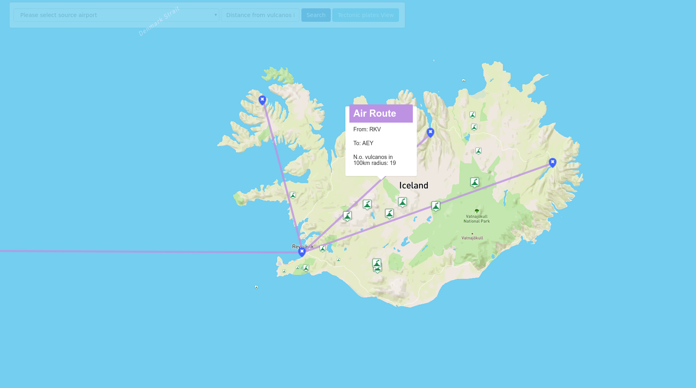

*This is a documentation for a fictional project, just to show you what I expect. Notice a few key properties:*
- *no cover page, really*
- *no copy&pasted assignment text*
- *no code samples*
- *concise, to the point, gets me a quick overview of what was done and how*
- *I don't really care about the document length*
- *I used links where appropriate*

# Overview

This application shows vulcanoes, airport, flight routes and tectonic plates around the world. Most important features are:
- search of certain airport
- diplaying routes from selected airport
- displaying vulcanos in a certain distance from selected airport
- displaying vulcanos in safe distance from flight route (click on a certain flight route)
- search of certain tectonic plate and displaying all vulcanos that lay on the plate

This is it in action:

The application has 2 separate parts, the client which is a [frontend web application](#frontend) using MapBox GL JS and the [backend application](#backend) written in [Rails](http://rubyonrails.org/), backed by PostGIS. The frontend application communicates with backend using a [REST API](#api).

# Frontend

The frontend application is a dynamic HTML page using two main controlles `app/controller/map_controller.rb` a `app/controller/plates_controller.rb`, each controller uses separate views which show a MapBox GL JS widget with a simple rails form. 
The `map_controller.rb` handles use cases for displaying closest vulcanos to airports, closest vulcanos to flight routes and displaying all flighting routes from the selected airport. Clicking on airport, vulcano or route display a popup with certain information. 
The `plates_controller.rb` handles use case for displaying vulcanos on selected 

All relevant frontend code is in `app/views/map` for map controller use cases and `app/views/plates` for plates controller use cases. The frontend code is very simple, its only responsibilities are:
- detecting user's location, using the standard [web location API](https://developer.mozilla.org/en-US/docs/Web/API/Geolocation/Using_geolocation)
- displaying rails search form with airports list, driving the user interaction and calling the appropriate backend APIs
- displaying geo features by overlaying the map with a geojson layer, the geojson is provided directly by backend APIs

# Backend

The backend application is written in Ruby on Rails and is responsible for querying geo data, formatting the geojson and data for the displaying on the map and in search forms.

## Data

Data comes directly in GeoJSON format. I downloaded an extent covering all worlds active vulcanos, all tectonic plates, all available airports and around 66k flight routess. I imported it using the `ogc2ogc` tool directly into the Postgis database. Thanks to rails an index was automaticaly created on geometry column (`wkb_geometry`) in all tables. The application follows standard Rails conventions and all queries are placed in models inside `app/models`, mostly in `app/models/open_airport.rb`, `app/models/vulcano.rb`, `app/models/flight_route.rb`. GeoJSON is generated by using `rgeo-geojson` gem and some postprocessing is necessary for every model in `app/models` with method `build_geojson`. After that controller handler creating the final geojson (merge all small geojson for every model into a single geojson).

## Api

**Find vulcanos from selected airport in a cerain distance**

`GET /map/search?utf8=✓&src_id=178&vulc_dist=100&commit=Search`

**Find all vulcanos on the selected tectonic plate**

`GET /plates/get_plate?utf8=✓&id=6&commit=Show`

**Find vulcanos near flight route (on click)**

`GET /map/vulcanoes_near_route?route_id=32488&distance=100`

 Postgis query:
 
 `Vulcano.find_by_sql("
    SELECT v.*, ST_Distance(a.wkb_geometry::geography, v.wkb_geometry::geography) / 1000 AS distance_km
    FROM vulcanoes v, open_airports a
    WHERE a.identif = '#{airport_id}' AND ST_DWithin(a.wkb_geometry::geography, v.wkb_geometry::geography, #{distance} * 1000);
    ")`
 
### Response

Api calls returns directs geojson data. Data is being displayed directly to the map with some JS postprocessing.
